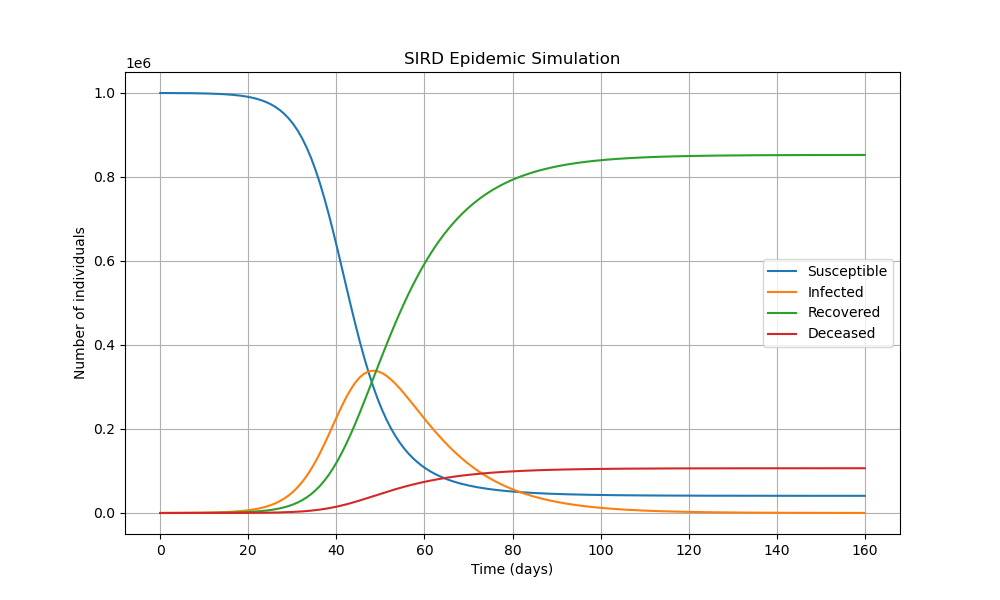
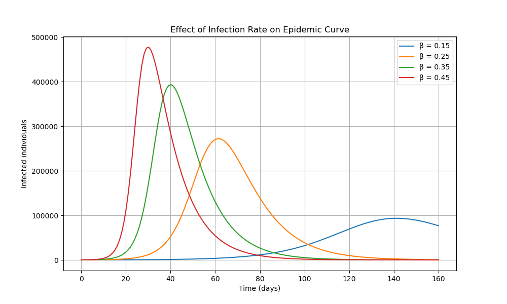
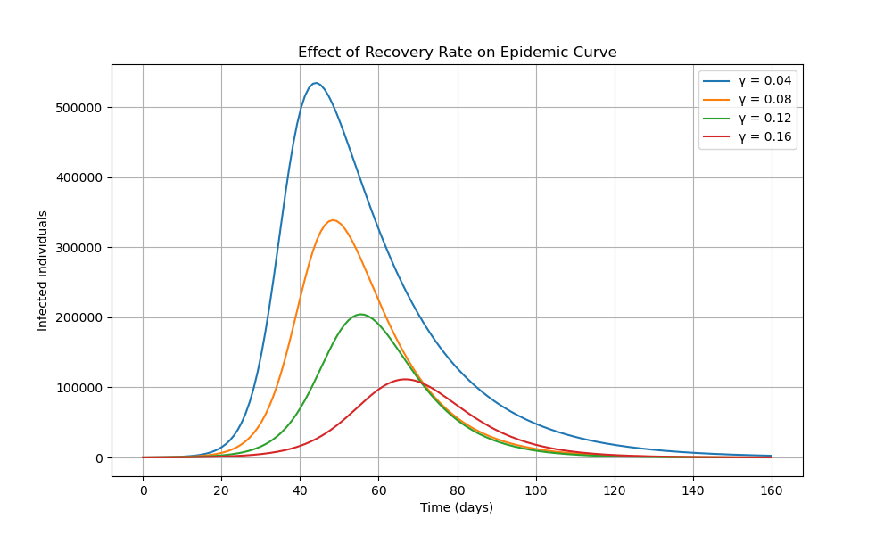
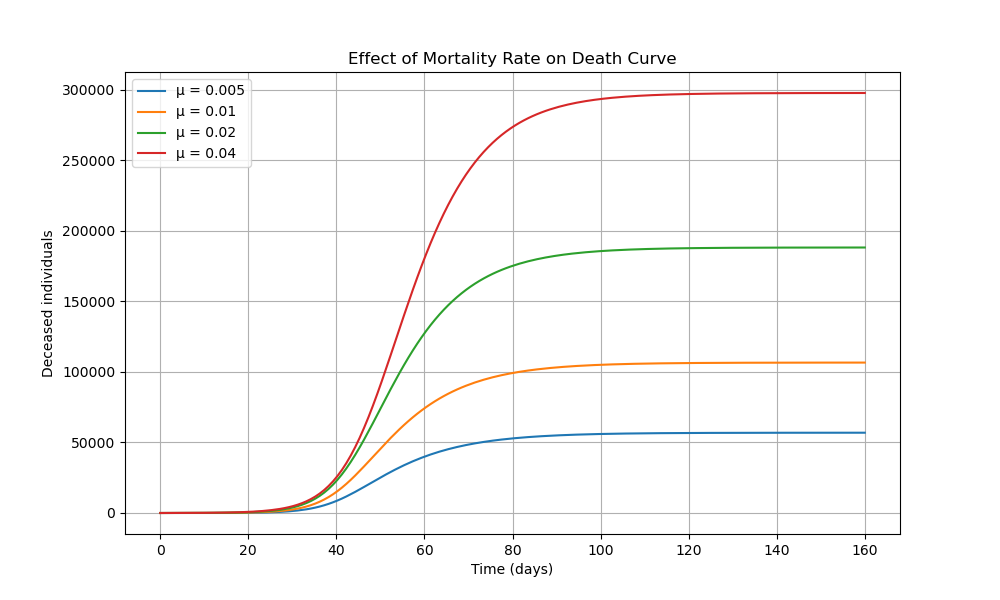
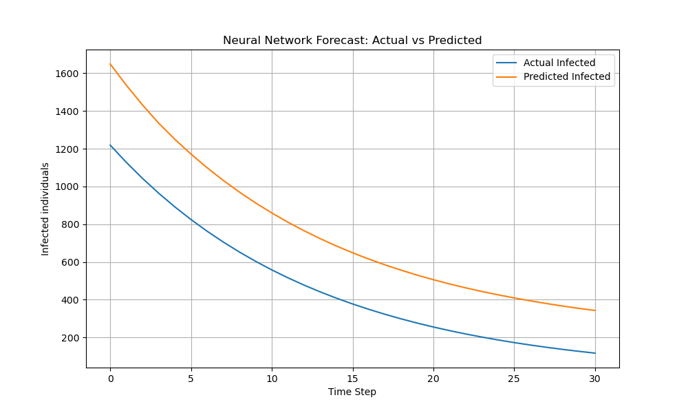
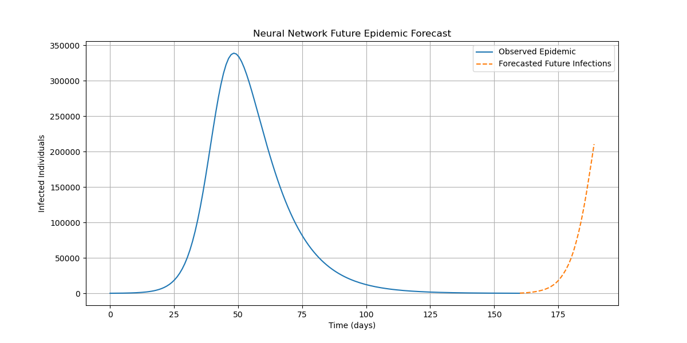
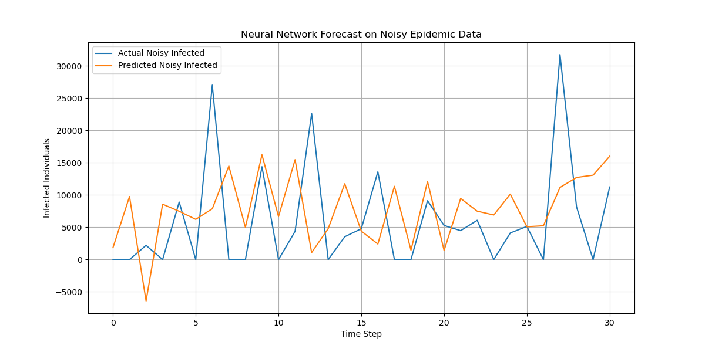

# Epidemic Forecasting using SIRD and Neural Networks

### Mechanistic Epidemic Modeling, Neural Forecasting, and Robustness Analysis

---

## Abstract

Epidemic forecasting plays a critical role in public health planning, outbreak monitoring, and healthcare resource allocation. Traditional epidemiological models provide interpretable mathematical descriptions of disease spread, while machine learning models offer flexible data-driven forecasting capabilities.

This project investigates epidemic forecasting using both a classical **SIRD (Susceptible–Infected–Recovered–Deceased)** compartmental model and **Neural Network-based time-series forecasting**. The study compares mechanistic and data-driven approaches, evaluates forecasting performance, and analyzes robustness under noisy epidemic conditions.

The project further explores recursive future forecasting and demonstrates how neural forecasting models may become unstable when uncertainty and reporting noise are introduced into epidemic data.

---

## 1. Problem Statement

Epidemic forecasting systems face several important challenges:

* Capturing nonlinear epidemic dynamics accurately
* Maintaining interpretability in forecasting systems
* Forecasting future trajectories under uncertainty
* Handling noisy and irregular epidemic data
* Balancing mechanistic modeling with data-driven learning

This project addresses these challenges by combining differential equation-based epidemic modeling with neural network forecasting approaches.

---

## 2. Objectives

* Develop a classical SIRD epidemic simulation model
* Analyze parameter sensitivity in epidemic dynamics
* Generate synthetic epidemic time-series datasets
* Train neural networks for epidemic forecasting
* Compare mechanistic and data-driven forecasting approaches
* Investigate recursive forecasting behavior
* Evaluate robustness under noisy epidemic conditions

---

## 3. Mathematical Background

### 3.1 SIRD Model

The epidemic dynamics are governed by the following differential equations:

```math
dS/dt = -βSI/N

dI/dt = βSI/N - γI - μI

dR/dt = γI

dD/dt = μI
```

where:

* **S(t)** = susceptible population
* **I(t)** = infected population
* **R(t)** = recovered population
* **D(t)** = deceased population
* **β** = infection rate
* **γ** = recovery rate
* **μ** = mortality rate
* **N** = total population

---

## 4. Methodology

### 4.1 Mechanistic Epidemic Modeling

* SIRD compartmental simulation
* Numerical integration using ODE solvers
* Epidemic trajectory visualization

### 4.2 Parameter Sensitivity Analysis

* Infection rate sensitivity
* Recovery rate sensitivity
* Mortality rate sensitivity

### 4.3 Neural Forecasting

* Sliding-window time-series preparation
* Feedforward neural network forecasting
* Recursive future prediction

### 4.4 Robustness Analysis

* Artificial noise injection
* Forecast degradation analysis
* Uncertainty evaluation

---

## 5. Synthetic Epidemic Dataset

The SIRD simulation outputs were converted into a structured time-series dataset containing:

* Susceptible population
* Infected population
* Recovered population
* Deceased population

This synthetic dataset provides a controlled environment for evaluating forecasting systems while preserving known epidemic dynamics.

---

## 6. Neural Network Forecasting

A feedforward neural network was trained to predict future infection dynamics using historical infected population values.

### Forecasting Setup

* Input window size: 7 days
* Forecast target: next-day infected population
* Chronological train-test split
* MinMax normalization applied

---

## 7. Forecast Evaluation

The neural network achieved strong forecasting performance on smooth synthetic epidemic data.

### Forecast Metrics

* Mean Absolute Error (MAE): **124.24**
* Mean Squared Error (MSE): **15516.14**
* Root Mean Squared Error (RMSE): **124.56**
* R² Score: **0.8471**

These results indicate that the neural network successfully captured the nonlinear epidemic dynamics generated by the SIRD model.

---

## 8. Mechanistic vs Data-Driven Forecasting

This project compares two fundamentally different forecasting paradigms:

| Approach | Type | Strengths | Limitations |
|-----------|------|------------|--------------|
| SIRD Model | Mechanistic | Interpretable epidemic structure | Requires parameter assumptions |
| Neural Network | Data-Driven | Flexible nonlinear forecasting | Less interpretable |

### Key Insight

Mechanistic models provide epidemiological interpretability, while neural networks offer flexible pattern-learning capabilities. The approaches are complementary rather than mutually exclusive.

---

## 9. Recursive Forecasting and Drift

The neural network was recursively used to forecast future epidemic trajectories beyond the observed simulation period.

### Observation

Long-term recursive forecasting produced forecast drift and instability, where predictions deviated from expected epidemic decline patterns.

This highlights an important limitation of purely data-driven forecasting systems:

* Small prediction errors accumulate over time
* Recursive forecasts may become unstable
* Long-term extrapolation becomes increasingly uncertain

---

## 10. Noise and Robustness Analysis

Artificial noise was introduced into the epidemic time series to simulate realistic reporting uncertainty.

### Key Findings

* Forecasting performance degraded substantially under noisy conditions
* Neural networks became sensitive to irregular epidemic fluctuations
* The noisy forecasting experiment produced a negative R² score, indicating poor generalization under uncertainty

This demonstrates the importance of:

* Robustness analysis
* Uncertainty quantification
* Hybrid mechanistic-ML forecasting systems

---

## 11. Visual Analysis

### SIRD Epidemic Simulation



### Infection Rate Sensitivity



### Recovery Rate Sensitivity



### Mortality Rate Sensitivity



### Neural Forecast



### Future Epidemic Forecast



### Noisy Forecast Analysis



---

## 12. Key Insights

* SIRD models provide interpretable epidemic dynamics
* Neural networks effectively learn nonlinear epidemic patterns
* Recursive forecasting may accumulate long-term prediction errors
* Forecasting systems can become unstable under noisy conditions
* Mechanistic and machine learning approaches are complementary

---

## 13. Future Work

* LSTM and recurrent neural forecasting models
* Hybrid mechanistic-machine learning systems
* Bayesian epidemic uncertainty quantification
* Real-world COVID-19 or Hantavirus data integration
* Physics-informed neural networks (PINNs)
* Spatiotemporal epidemic forecasting

---

## 14. Technologies Used

* Python
* NumPy & Pandas
* SciPy
* Scikit-learn
* TensorFlow / Keras
* Matplotlib
* Jupyter Notebook

---

## 15. Project Structure

```text
Epidemic-Forecasting-SIRD-Neural-Networks/
│
├── data/               # Synthetic epidemic datasets
├── figures/            # Forecasting and simulation plots
├── notebooks/          # Jupyter notebooks and experiments
├── results/            # Forecast evaluation metrics
├── src/                # Source code modules
├── README.md           # Project documentation
└── requirements.txt    # Dependencies
```

---

## 16. Reproducibility

This project is fully reproducible. Follow the steps below to replicate the experiments and results.

### 16.1 Clone the repository

```bash
git clone https://github.com/Katso-John-Obotsang/Epidemic-Forecasting-SIRD-Neural-Networks.git

cd Epidemic-Forecasting-SIRD-Neural-Networks
```

### 16.2 Create a virtual environment (recommended)

```bash
conda create -n epidemic-forecasting python=3.10

conda activate epidemic-forecasting
```

### 16.3 Install dependencies

```bash
pip install -r requirements.txt
```

### 16.4 Run the project

Open Jupyter Notebook and execute the analysis:

```bash
jupyter notebook
```

Ensure that all datasets are located in the `data/` directory before running the notebooks.

---

## 17. Author

**Katso John Obotsang**

Machine Learning | Quantitative Methods | AI Research

Email: [katsojohnobotsang@gmail.com](mailto:katsojohnobotsang@gmail.com)

---

## 18. License

This project is licensed under the MIT License.

See the full license here: [MIT License](LICENSE)
